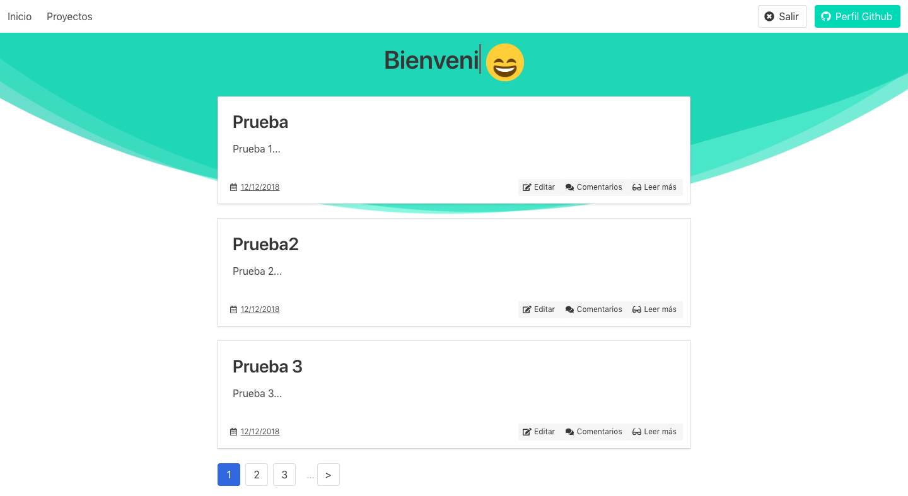
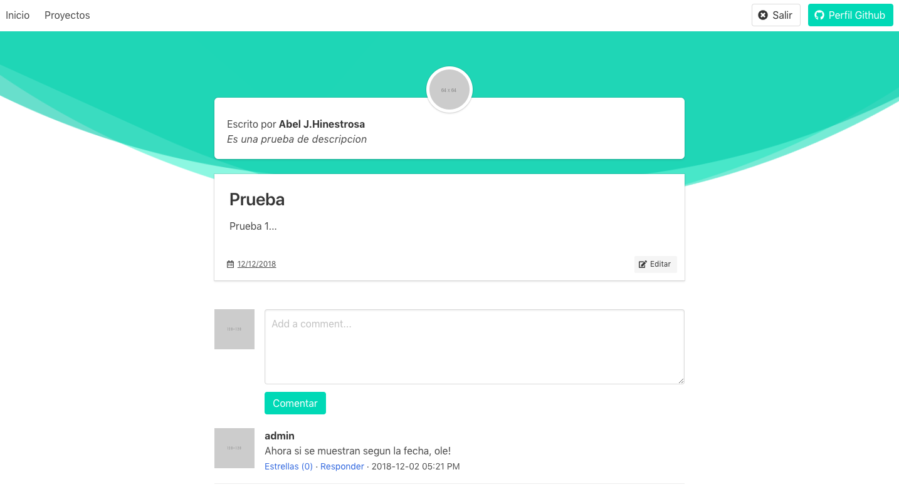

<h1>CI-bulma_config</h1>

Sistema de bloggin programado en CODEIGNITER 3 y Bulma CSS. Cuenta con gestión de usuarios, sesiones, posts, categorias, tags, panel administración, sistemas de likes, comentarios...

En el BACK-END: CodeIgniter 3
En el Front-END: Bulma 0.7.2

<h1>Screenshot INICIO</h1>

<h1>
Screenshot Post y Comentarios
</h1>

